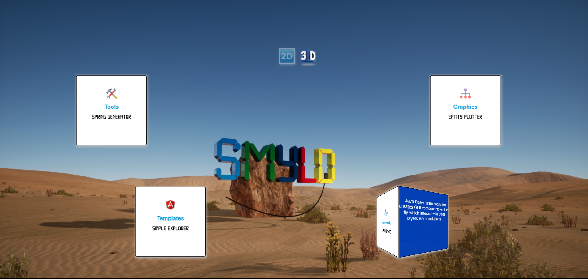
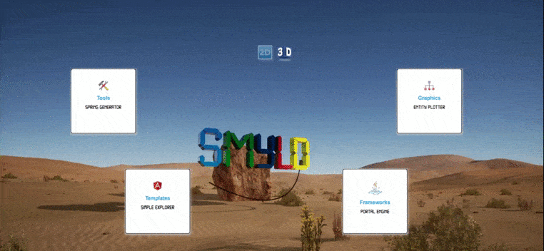

[](https://www.jsdelivr.com/package/npm/smyld-lib-3d)
[](https://github.com/MFjamil/smyld-lib-3d/blob/master/LICENSE)
[](https://www.npmjs.com/package/smyld-lib-3d)


# SMYLD 3d Components Web Library 
is a web library for 3d VUE components. After the invention of the 3d Transformations in CSS, it is time now to have that reflected on the web components. Which had already started in many web applications. This Library is aimed to host such 3D components. The created Components are done using VUE framework and is available on the Internet already via NPM repository 

Below is a sample out of the [smyld.org](http://www.smyld.org)  website itself, is using this library to show the different product items.





## Usage
### For Web Site designers
add the link of the library to your webpage :

```xml
<script src="https://cdn.jsdelivr.net/npm/smyld-lib-3d@0.1.36/dist/smyld-lib-3d.min.js"></script>
```

the following code will define the component in your page, below is sample for creating the box similar to the sample above:
```xml
     <smyld-lib-3d-box settings="width:400px;height: 200px;length:150px;bg-front:red;">
        <div slot="front" style="color: blue;">
            Front Side
        </div>
        <div slot="right" >
            Right Side
        </div>
    </smyld-lib-3d-box>
```
Below is the code for creating the Qube (which inlcudes more features compared to the box):

```xml
<smyld-lib-3d-qube settings="width:300;height: 400;length:150;" show="back" >
      <div slot="front" style="padding-top:30px;" >Front</div>
      <div slot="right" style="padding-top:30px;">Right</div>
      <div slot="left" style="padding-top:30px;">Left</div>
      <div slot="back" style="padding-top:30px;">Back</div>
      <div slot="top" style="padding-top:30px;">Top</div>
      <div slot="bottom" style="padding-top:30px;">Bottom</div>
</smyld-lib-3d-qube>
```



 


